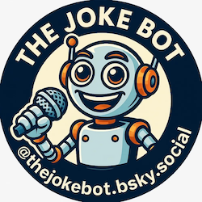

# The Joke Bot

Posts dad jokes to the Bluesky account [thejokebot.bsky.social](https://bsky.app/profile/thejokebot.bsky.social), plus account housekeeping automations.

## What this repo does

- Posts a joke three times per day on a schedule.
- Avoids reposting the same joke within a rolling 90-day window.
- Rotates across multiple live joke APIs with a bundled offline fallback.
- Supports follow-back, reply liking, unfollow, and fellow-follow discovery scripts.
- Lets followers report unsuitable jokes via a `#report` reply, which triggers an automated PR to add the joke to a permanent denylist.

## Quick start (local)

1. Install Python 3.11 or newer.
2. Install dependencies:
	- `python -m pip install -r requirements.txt`
3. Copy and set environment values:
	- `cp .env.example .env`
4. Run a script:
	- `python bluesky_post_joke.py`

## Local validation helper

After merges (for example Dependabot updates), run the local test helper:

- `./scripts/test-local.sh`

If you prefer a direct one-liner without the helper script:

- `.venv/bin/python -m pytest tests/ -v --tb=short`

## Environment variables

Set these in `.env` (keep values quoted):

| Variable | Required | Description |
|---|---|---|
| `BLUESKY_USERNAME` | No | Account handle. Defaults to `thejokebot.bsky.social`. |
| `BLUESKY_PASSWORD` | Yes | App password for the Bluesky account. |
| `API_NINJAS_API_KEY` | No | API key for the API Ninjas jokes endpoint. Only needed if you want the `api_ninjas` backup provider. |
| `BLUESKY_DRY_RUN` | No | Set to `true` to log actions without applying them. |
| `BLUESKY_ACTION_DELAY_SECONDS` | No | Seconds to wait between follow/unfollow actions. |
| `BLUESKY_NETWORK_RETRY_ATTEMPTS` | No | Max attempts for transient network retries across API fetch/follow/like/unfollow/report calls (default `3`). |
| `BLUESKY_NETWORK_RETRY_DELAY_SECONDS` | No | Initial retry delay in seconds for transient network failures (default `1`). |
| `BLUESKY_NETWORK_RETRY_BACKOFF_FACTOR` | No | Multiplier applied to each retry delay step (default `2`). |
| `BLUESKY_UNFOLLOW_MAX_ACTIONS` | No | Safety cap per run for unfollow actions (default `200`; set `0` for no cap). |
| `BLUESKY_UNFOLLOW_BATCH_SIZE` | No | Unfollow batch size before pause (default `50`). |
| `BLUESKY_UNFOLLOW_BATCH_PAUSE_SECONDS` | No | Pause between unfollow batches in seconds (default `60`). |
| `BLUESKY_UNFOLLOW_IGNORE` | No | Comma-separated fully-qualified handles to protect from unfollowing (e.g. `theonion.bsky.social`). |
| `BLUESKY_JOKE_PROVIDER` | No | Force a specific provider by name (`icanhazdadjoke`, `jokeapi`, `groandeck`, `syrsly`, `api_ninjas`, `jokebot_jokebook`). Leave unset for normal rotation. |
| `BLUESKY_REPORT_MAX_PAGES` | No | Max notification pages to fetch per report run (default `3`). |
| `BLUESKY_REPORT_PAGE_LIMIT` | No | Notifications per page when polling for reports (default `100`). |

## Runtime safety controls

- **Dry run:** set `BLUESKY_DRY_RUN='true'` to log actions without applying them. Applies to `bluesky_follows_and_likes.py`, `bluesky_unfollow.py`, and `bluesky_follow_fellows.py`.
- **Throttling:** set `BLUESKY_ACTION_DELAY_SECONDS='1.5'` (example) to slow follow/unfollow/like loops.
- **Network retries:** set `BLUESKY_NETWORK_RETRY_ATTEMPTS`, `BLUESKY_NETWORK_RETRY_DELAY_SECONDS`, and `BLUESKY_NETWORK_RETRY_BACKOFF_FACTOR` to tune bounded retries for transient network/API failures.
- **Unfollow batching:** `bluesky_unfollow.py` is capped and batched by default (`BLUESKY_UNFOLLOW_MAX_ACTIONS=200`, `BLUESKY_UNFOLLOW_BATCH_SIZE=50`, `BLUESKY_UNFOLLOW_BATCH_PAUSE_SECONDS=60`) to reduce throttle risk on large clean-ups.
- **Post length preflight:** `bluesky_post_joke.py` skips over-long jokes and retries provider fetches before posting, so posts stay within Bluesky's 300-character limit after hashtags are appended.

Bluesky rate-limit context (as documented):
- Repository write budget is point-based per account: `5000` points/hour and `35000` points/day; delete operations cost `1` point each.
- Hosted PDS API requests are also rate-limited by IP (`3000` requests per `5` minutes).
- This repo defaults to conservative unfollow batches so multi-thousand clean-ups can be done over repeated runs instead of one aggressive burst.

## Reporting a joke (#report)

If a posted joke is unsuitable, any Bluesky user can flag it:

1. Reply to the joke post with the hashtag `#report` (case-insensitive, standalone — e.g. `#report this is offensive`).
2. That's it. The bot picks up the reply automatically within 30 minutes.

The report triggers an automated PR adding the joke to the denylist. Once a maintainer merges the PR, the joke will never be posted again and the original post is deleted from the account on the next report run.

## Scripts

| Script | Purpose |
|---|---|
| `bluesky_post_joke.py` | Fetch a joke, append hashtags, post to Bluesky, maintain `bot_state.json`. |
| `bluesky_follows_and_likes.py` | Follow back new followers and like replies to the bot's posts. |
| `bluesky_unfollow.py` | Unfollow accounts that do not follow back (respects an ignore list). |
| `bluesky_follow_fellows.py` | Find hashtag users and follow up to configured limits. |
| `bluesky_verify_latest_joke_post.py` | Read-only check that a recent joke post exists on the account. |
| `bluesky_process_reports.py` | Poll reply notifications for `#report`, map replies to posted jokes, delete approved denylist posts, and write PR proposals. |
| `bluesky_create_report_prs.py` | Open one denylist PR per new report proposal. |

## Report workflow (technical detail)

The report pipeline runs every 30 minutes via the `bluesky_process_reports` workflow. Each run:

1. **Deletes approved posts.** Reads `resources/jokebot_denylist.json` for entries with a `source_post_uri` and deletes those Bluesky posts if not already deleted. Deleted URIs are recorded in `bot_state.json` so the attempt is not retried.
2. **Scans reply notifications.** Fetches the most recent reply notifications (up to `BLUESKY_REPORT_MAX_PAGES` × `BLUESKY_REPORT_PAGE_LIMIT` entries). Already-processed notification URIs are stored in `bot_state.json` and skipped.
3. **Identifies `#report` replies.** A notification qualifies if it is a reply and its text contains `#report` as a standalone hashtag.
4. **Resolves the reported joke.** The reply's parent URI is looked up in the post URI index in `bot_state.json`. If not found there (e.g. state was reset), the post text is fetched live from the Bluesky API and encoded.
5. **Skips duplicates.** Jokes already in the denylist, or reported more than once in the same run, produce only one proposal.
6. **Emits proposals.** New proposals are written to `.agent-tmp/report_proposals.json`.
7. **Opens PRs.** `bluesky_create_report_prs.py` reads the proposals file and opens one pull request per new report. Each PR adds the joke's base64 value and evidence (post URI, reply URI, reporter DID) to `resources/jokebot_denylist.json`. Branches are named `chore/report-denylist-<sha1-prefix>` and skip creation if a matching remote branch or open PR already exists.
8. **Updates checkpoint state.** Processed notification URIs and the deletion record are saved back to `bot_state.json` and committed to `main` by the workflow.

## State

| File | Purpose |
|---|---|
| `bot_state.json` | Runtime state: posted joke history (b64, deduplication), provider rotation, report notification checkpoints, deleted post URIs, liked reply URIs. |
| `resources/jokebot_denylist.json` | Repository-backed denylist. Jokes added here are permanently excluded from posting. |
| `resources/jokebot_jokebook.json` | Bundled offline joke pool (446 jokes). Used as final fallback when all live APIs are unavailable. |

## Credits

Joke content is sourced from these third-party APIs:

- [icanhazdadjoke](https://icanhazdadjoke.com/api) — free dad jokes API
- [JokeAPI](https://jokeapi.dev) — multi-category joke API
- [GroanDeck](https://groandeck.com/api/v1/random) — free two-part groan-worthy jokes API
- [Syrsly Jokes API](https://www.syrsly.com/joke) — text dad-joke endpoint used as a backup provider
- [API Ninjas Jokes](https://api-ninjas.com/api/jokes) — supplementary backup provider

