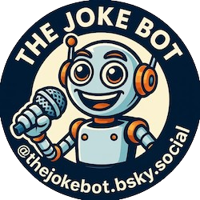

# The Joke Bot

<table>
	<tr>
		<td width="280" valign="top" align="center">
			
		</td>
		<td valign="top">
			<a href="https://github.com/chris-gillatt/thejokebot/actions/workflows/bluesky_post_joke.yml"></a><br />
			<a href="https://github.com/chris-gillatt/thejokebot/actions/workflows/bluesky_dashboard.yml"></a><br />
			<a href="https://github.com/chris-gillatt/thejokebot/actions/workflows/bluesky_follows_and_likes.yml"></a>
			<a href="https://github.com/chris-gillatt/thejokebot/actions/workflows/bluesky_follow_fellows.yml"></a><br />
			<a href="https://github.com/chris-gillatt/thejokebot/actions/workflows/bluesky_unfollow.yml"></a><br />
			<a href="https://github.com/chris-gillatt/thejokebot/actions/workflows/bluesky_process_reports.yml"></a><br />
			<a href="https://github.com/chris-gillatt/thejokebot/actions/workflows/python_tests.yml"></a>
			<a href="https://github.com/chris-gillatt/thejokebot/actions/workflows/ruff_quality.yml"></a>
			<a href="https://github.com/chris-gillatt/thejokebot/actions/workflows/validate_runtime_config.yml"></a><br />
			<a href="https://github.com/chris-gillatt/thejokebot/actions/workflows/codeql.yml"></a><br />
			<a href="https://sonarcloud.io/summary/overall?id=chris-gillatt_thejokebot"></a><br />
			<a href="https://github.com/chris-gillatt/thejokebot/actions/workflows/dependabot-auto-merge.yml"></a>
		</td>
	</tr>
</table>

Posts dad jokes to a configured Bluesky account, plus account housekeeping automations.

## Functionality

- Posts regular jokes by a schedule.
- Avoids duplicating jokes within a rolling 730-day window.
- Rotates across multiple live joke APIs with a bundled offline fallback.
- Supports follow-back, reply liking, unfollow, and fellow-follow discovery scripts.
- Uses a rotating set of configured humour/follow-back hashtags for fellow-follow discovery, with a conservative per-run cap and state-backed tag rotation so the same tags do not always get first priority.
- Rotates hashtags appended to joke posts using the posting runtime-config tag pool, with deterministic per-post progression and grapheme-aware length fitting.
- Gives newly followed accounts a 90-day grace period before they become eligible for unfollow if they still do not follow back.
- Lets followers report unsuitable jokes via a `#report` reply, which triggers an automated PR to add the joke to a permanent denylist.
- Publishes a six-hourly GitHub Pages dashboard with the latest joke, account trends, posting activity, unfollows, and received engagement.

## Statistics dashboard

The public dashboard is available at <https://chris-gillatt.github.io/thejokebot/>.
It is rebuilt every six hours from aggregate public data served by Bluesky's
cached public API, with the latest joke rendered through Bluesky's official post
embed. A build-and-run section shows rolling 30-day first-party workflow
reliability, retained publication mix by joke provider, provider fall-through
pressure with distinct candidate-rejection reasons, average received engagement,
and current provider health.

Follower totals use collection-time snapshots. For up to 30 days, following and
profile-post totals are reconstructed from aggregate successful-action workflow
logs and retained post timestamps; unknown historical follower totals remain
blank rather than being estimated. Joke-post, follow, and unfollow activity is
also shown by day.

Normalised public telemetry is retained indefinitely in UTC monthly JSON files.
The initial dashboard payload contains current and rolling 30-day data; selecting
the all-time range lazily loads daily points derived from the canonical monthly
history. The default Audience view presents public account and engagement trends;
the Operations view contains rolling workflow, provider, moderation, and delivery
health. Discovery follow success is successful follows divided by selected
accounts. Dashboard data contains no follower, liker, replier, or other audience
DIDs, raw workflow logs, or raw API responses.

Preview the same staged artifact used by GitHub Pages with:

```bash
./scripts/preview-dashboard.sh
```

The preview is served at <http://localhost:8765/>. Set
`DASHBOARD_PREVIEW_PORT` to use a different local port.

## Quick start (local)

1. Install Python 3.11 or newer.
2. Install dependencies:
	- `python -m pip install -r requirements.txt`
3. Copy and set environment values:
	- `cp .env.example .env`
4. Run a script:
	- `python bluesky_post_joke.py`

## Syncing repo and submodules

To keep your working copy up to date with the remote (including read-only reference submodules), run:

```bash
git pull --rebase && git submodule update --init --recursive
```

This is also available as a VS Code task: **Terminal → Run Task → Sync repo and submodules**.

Run this at the start of each development session to ensure `references/` (atproto, bps-website, cookbook) are at their current upstream versions.

## Local validation helper

Before commit/push, run the local preflight gate:

- `./scripts/preflight-local.sh`

This runs:

- Ruff lint (`ruff check .`)
- Ruff format check (`ruff format --check .`)
- Workflow lint (`./scripts/lint-workflows.sh`, powered by actionlint)
- Unit tests with application coverage (`pytest-cov`, minimum 75%)
- Local CodeQL analysis (required by default)

Linting/format checks and tests are a single validation gate in this repository;
running only tests is not considered sufficient before commit/push.

If CodeQL is temporarily unavailable, you can explicitly run in reduced-coverage mode:

- `BLUESKY_PREFLIGHT_ALLOW_REDUCED_COVERAGE=true ./scripts/preflight-local.sh`

This should be exceptional; default behaviour fails fast with install hints for missing dependencies.

If you only want to run the unit test suite locally (without Ruff/CodeQL), run:

- `./scripts/test-local.sh`

Equivalent GitHub Actions workflow: `python_tests`. It generates `coverage.xml`,
submits the analysis to SonarQube Cloud, and fails when either the 75% application
coverage floor or the Sonar quality gate is not met. Sonar analysis runs for
`main`, manual dispatches, and trusted pull-request branches; fork pull requests
do not receive the repository token.

CI-based Sonar analysis requires a repository Actions secret named
`SONAR_TOKEN`. The same secret must be configured for Dependabot if its pull
requests are expected to run analysis. Automatic analysis must remain disabled
under the SonarQube Cloud project's **Administration → Analysis Method** settings
to prevent duplicate, conflicting analyses.

If you prefer a direct one-liner without the helper script:

- `.venv/bin/python -m pytest tests/ -v --tb=short`

For local code-quality checks aligned with CI:

- `.venv/bin/ruff check .`
- `.venv/bin/ruff format --check .`
- `./scripts/lint-workflows.sh`

Workflow lint uses `actionlint` when installed locally and falls back to
`rhysd/actionlint:latest` via Docker when available.

## Environment variables

Set these in `.env` (keep values quoted):

| Variable | Required | Description |
|---|---|---|
| `BLUESKY_USERNAME` | Yes | Account handle for the bot account (for example `yourbot.bsky.social`). |
| `BLUESKY_APP_PASSWORD` | Yes by default | App password for the Bluesky account. Used when `BLUESKY_PASSWORD_SOURCE=app_password`, including all production workflows. |
| `BLUESKY_PASSWORD_SOURCE` | No | Credential source: `app_password` (default) or `account_password`. Account-password use must be explicitly enabled. |
| `BLUESKY_PASSWORD` | Explicit override only | Full Bluesky account password. Used only when `BLUESKY_PASSWORD_SOURCE=account_password`; never selected automatically. |
| `BLUESKY_SESSION_CACHE_KEY` | Production workflows | Repository secret used to encrypt cached Bluesky session credentials before GitHub cache storage. |
| `API_NINJAS_API_KEY` | No | API key for the API Ninjas jokes endpoint. Only needed if you want the `api_ninjas` backup provider. |
| `BLUESKY_DRY_RUN` | No | Set to `true` to log actions without applying them (also used by `bluesky_manage_starter_pack.py` for preview mode). |
| `BLUESKY_ACTION_DELAY_SECONDS` | No | Seconds to wait between follow/unfollow actions. |
| `BLUESKY_NETWORK_RETRY_ATTEMPTS` | No | Max attempts for transient network retries across API fetch/follow/like/unfollow/report calls (default `3`). |
| `BLUESKY_NETWORK_RETRY_DELAY_SECONDS` | No | Initial retry delay in seconds for transient network failures (default `1`). |
| `BLUESKY_NETWORK_RETRY_BACKOFF_FACTOR` | No | Multiplier applied to each retry delay step (default `2`). |
| `BLUESKY_UNFOLLOW_MAX_ACTIONS` | No | Explicit safety-cap override per unfollow run. By default, the cap is derived from four weeks of configured follow-fellows capacity; set `0` for no cap. |
| `BLUESKY_UNFOLLOW_BATCH_SIZE` | No | Unfollow batch size before pause (default `50`). |
| `BLUESKY_UNFOLLOW_BATCH_PAUSE_SECONDS` | No | Pause between unfollow batches in seconds (default `60`). |
| `BLUESKY_UNFOLLOW_IGNORE` | No | Comma-separated fully-qualified handles to protect from unfollowing (e.g. `theonion.bsky.social`). |
| `BLUESKY_BLOCK_DIDS` | No | Private comma/newline-separated DID policy that restores missing Bluesky blocks before follow and like processing. Repository variables may include trailing handle comments for readability. |
| `BLUESKY_JOKE_PROVIDER` | No | Force a specific provider by name (`icanhazdadjoke`, `jokeapi`, `groandeck`, `syrsly`, `api_ninjas`, `jokebot_jokebook`). Leave unset for normal rotation. |
| `BLUESKY_REPORT_MAX_PAGES` | No | Max notification pages to fetch per report run (default `3`). |
| `BLUESKY_REPORT_PAGE_LIMIT` | No | Notifications per page when polling for reports (default `100`). |
| `BLUESKY_REPORT_MAX_UNRESOLVED_ATTEMPTS` | No | Max retries for unresolved report notifications before they are marked processed to prevent indefinite retry loops (default `3`). |

The bot never changes credential sources automatically. Production workflows set
`BLUESKY_PASSWORD_SOURCE=app_password`. For a deliberate local account-password
login, set `BLUESKY_PASSWORD_SOURCE=account_password` and `BLUESKY_PASSWORD`.

Scheduled workflows share the latest encrypted session cache generation. A revoked
or invalid cached session is deleted before the configured credential is used to
create a replacement session. Transient service failures are retried without
changing credential source or discarding a potentially valid session.

## Central runtime config

Shared non-secret defaults now live in `resources/jokebot_runtime_config.json`.

Current config sections:

- `posting` defaults (history window, provider retry attempts, post character budget, and hashtag controls including `tag_pool`).
- `follow_fellows` defaults (per-tag/global follow limits, search page limit, hashtag set).
- `follows_and_likes` defaults (like and interaction-follow page/pagination limits).
- `unfollow` defaults (per-run cap, batching controls, baseline protected handles).
- `reports` defaults (page and pagination limits).
- `workflow_schedules` metadata for cadence visibility.

Precedence model for runtime behaviour:

1. Values in `resources/jokebot_runtime_config.json` are loaded as defaults.
2. Existing environment variables continue to override where supported by scripts (for example `BLUESKY_UNFOLLOW_MAX_ACTIONS`, `BLUESKY_REPORT_MAX_PAGES`, `BLUESKY_JOKE_PROVIDER`).

Secrets are not stored in runtime config and must remain in GitHub Secrets/local `.env`.

Validation guard rail:

- `bluesky_validate_runtime_config.py` validates runtime-config schema and checks that `workflow_schedules` metadata matches cron expressions in workflow files.
- It also enforces cadence-aware guard rails for high-blast-radius controls (report paging and unfollow/follow action caps) so risky schedule+limit combinations fail fast.
- GitHub Actions workflow `validate_runtime_config` runs this check on `pull_request`, `push` to `main`, and manual dispatch.

## Runtime safety controls

- **Dry run:** set `BLUESKY_DRY_RUN='true'` to log actions without applying them. Applies to `bluesky_follows_and_likes.py`, `bluesky_unfollow.py`, and `bluesky_follow_fellows.py`.
- **Throttling:** set `BLUESKY_ACTION_DELAY_SECONDS='1.5'` (example) to slow follow/unfollow/like loops.
- **Network retries:** set `BLUESKY_NETWORK_RETRY_ATTEMPTS`, `BLUESKY_NETWORK_RETRY_DELAY_SECONDS`, and `BLUESKY_NETWORK_RETRY_BACKOFF_FACTOR` to tune bounded retries for transient network/API failures.
- **Unfollow capacity and batching:** the default monthly cap matches four weeks of configured follow-fellows capacity. At the current `150` follows per run and twice-weekly cadence, that is `1,200` unfollows; `BLUESKY_UNFOLLOW_MAX_ACTIONS` can override it. Actions remain batched in groups of `50` with `60`-second pauses and stop early on throttling.
- **Follow-fellows cadence:** `bluesky_follow_fellows.py` runs twice weekly, rotates tag priority between runs, and uses the configured per-run cap and hashtag set from `resources/jokebot_runtime_config.json`.
- **Post hashtag rotation:** `bluesky_post_joke.py` rotates hashtags on each successful post using runtime precedence (`posting.tag_pool` → `follow_fellows.hashtags` → `posting.hashtags`) and calculates per-post length budget from selected tags before accepting a joke candidate.
- **Report retry bound:** `bluesky_process_reports.py` retries unresolved report notifications up to `BLUESKY_REPORT_MAX_UNRESOLVED_ATTEMPTS` before marking them processed to avoid infinite retry churn.
- **Starter-pack/list protection:** if `resources/jokebot_starter_pack.json` is enabled and points to a valid source list URI, all members of that list are automatically protected from unfollowing (unioned with `BLUESKY_UNFOLLOW_IGNORE`).
- **Follow grace protection:** `bluesky_unfollow.py` skips newly followed accounts for `90` days before they can become eligible for unfollow.
- **Post length preflight:** `bluesky_post_joke.py` skips over-long jokes and retries provider fetches before posting, using grapheme-aware length checks so posts stay within Bluesky's 300-character limit after hashtags are appended.

### Maintain persistent account blocks

Set the private GitHub repository variable `BLUESKY_BLOCK_DIDS` to the stable DIDs
that must remain blocked. One entry per line is recommended; an optional handle
comment keeps the list readable without using a changeable handle as identity:

```text
did:plc:example # example.bsky.social
did:web:example.com # another.example
```

The two-hour follows-and-likes workflow checks this policy before making social
actions and recreates missing blocks. It never removes blocks. Removing a DID
from the variable stops enforcing that block but does not unblock the account;
unblock it deliberately through Bluesky when required.

### Never auto-follow a user again

Use the existing DID-based `unfollow_history` state for accounts that should not
be auto-followed again. Do not add a separate handle block-list: auto-follow
paths compare DIDs, and handles can change.

1. Resolve the handle to a stable DID:

	```bash
	curl -s "https://bsky.social/xrpc/com.atproto.identity.resolveHandle?handle=example.bsky.social"
	```

2. Unfollow the account from the live Bluesky account if it is currently followed.
	The state change below prevents future auto-follows; it does not perform a
	live unfollow by itself.
3. In `state/social_state.json`, add the DID to `unfollow_history.entries`:

	```json
	{
	  "did": "did:plc:example",
	  "unfollowed_at": 1786064785,
	  "reason": "manual_block"
	}
	```

	Use the current Unix timestamp for `unfollowed_at`.
4. If the same DID appears in `follow_grace.entries`, remove that grace entry so
	it cannot protect the account from the next unfollow pass.
5. Validate and commit the state update:

	```bash
	python -m json.tool state/social_state.json >/dev/null
	ruff check .
	ruff format --check .
	python -m pytest tests/ -x -q
	```

Bluesky rate-limit context (as documented):
- Repository write budget is point-based per account: `5000` points/hour and `35000` points/day; delete operations cost `1` point each.
- Hosted PDS API requests are also rate-limited by IP (`3000` requests per `5` minutes).
- This repo defaults to conservative unfollow batches so multi-thousand clean-ups can be done over repeated runs instead of one aggressive burst.
- Follow-fellows stays well within those limits by using a modest twice-weekly schedule rather than large daily bursts.

## Reporting a joke (#report)

If a posted joke is unsuitable, any Bluesky user can flag it:

1. Reply to the joke post with the hashtag `#report` (case-insensitive, standalone — e.g. `#report this is offensive`).
2. That's it. The bot picks up the reply on the next scheduled report run (currently every 4 hours).

The report triggers an automated PR adding the joke to the denylist. Once a maintainer merges the PR, the joke will never be posted again and the original post is deleted from the account on the next report run.

## Scripts

| Script | Purpose |
|---|---|
| `bluesky_post_joke.py` | Fetch a joke, append a rotated hashtag window, post to Bluesky, and maintain posting state. |
| `bluesky_follows_and_likes.py` | Follow back new followers, follow users who interact with the bot's posts (replies, reposts, likes from the last 24 hours), and like replies to the bot's posts. |
| `bluesky_unfollow.py` | Unfollow accounts that do not follow back, while respecting protected handles, starter-pack protections, and the 90-day follow grace window. |
| `bluesky_follow_fellows.py` | Search a rotating set of humour/follow-back hashtags and follow up to the configured per-run cap. |
| `bluesky_verify_latest_joke_post.py` | Read-only check that a recent joke post exists on the account. |
| `bluesky_collect_dashboard_metrics.py` | Collect aggregate public profile, joke-post, engagement, and activity metrics for the static dashboard. |
| `bluesky_manage_starter_pack.py` | Convert/synchronise a starter pack from a configured Bluesky list and optionally follow missing list members. |
| `bluesky_process_reports.py` | Poll reply notifications for `#report`, map replies to posted jokes, delete approved denylist posts, and write PR proposals. |
| `bluesky_create_report_prs.py` | Open one denylist PR per new report proposal. |

## Starter pack workflow

Starter-pack operations are manual and safe by default.

Configuration lives in `resources/jokebot_starter_pack.json`:

- `enabled`: master switch for all starter-pack/list behaviour.
- `source_list_uri`: source list used for protection and starter-pack sync.
- `starter_pack_uri`: preferred update target URI (set after first live creation).
- `record_key`: optional TID rkey for explicit updates.
- `sync.follow_list_members`: when enabled, manager script follows list members not already followed.
- `sync.upsert_record`: when enabled, manager script updates the starter-pack record.

Run it via workflow dispatch: `bluesky_manage_starter_pack`.

- Leave `apply_changes=false` for dry-run preview.
- Set `apply_changes=true` to perform live follow/record mutations.

## Report workflow (technical detail)

The report pipeline runs every 4 hours via `bluesky_process_reports`.

1. It scans replies for `#report`, maps each report to a posted joke, and ignores duplicates.
2. It writes proposals to `.agent-tmp/report_proposals.json` and opens denylist PRs via `bluesky_create_report_prs.py`.
3. It updates `state/moderation_state.json` so notifications and deletions are not reprocessed.
4. Unresolved notifications are retried up to `BLUESKY_REPORT_MAX_UNRESOLVED_ATTEMPTS` before being marked processed.

`bluesky_follow_fellows` currently runs every Wednesday and Friday at 01:10 UTC. `bluesky_unfollow` currently runs monthly on the first day at 13:10 UTC.

## State

| File | Purpose |
|---|---|
| `state/posting_state.json` | Provider rotation and failures, posted joke history, deduplication data, and posting tag rotation. |
| `state/social_state.json` | Liked replies, unfollow history, follow grace and tracking, and follow-fellows tag rotation. |
| `state/moderation_state.json` | Report notification checkpoints, unresolved attempts, acknowledgements, and deleted post URIs. |
| `state/provider_health_state.json` | Latest provider health results and consecutive failure counters. |
| `resources/jokebot_denylist.json` | Repository-backed denylist. Jokes added here are permanently excluded from posting. |
| `resources/jokebot_jokebook.json` | Bundled offline joke pool (446 jokes). Used as final fallback when all live APIs are unavailable. |

## Security

For vulnerability reporting and security handling expectations, see [SECURITY.md](SECURITY.md).

## Credits

Joke content is sourced from these third-party APIs:

- [icanhazdadjoke](https://icanhazdadjoke.com/api) — free dad jokes API
- [JokeAPI](https://jokeapi.dev) — multi-category joke API
- [GroanDeck](https://groandeck.com/api/v1/random) — free two-part groan-worthy jokes API
- [Syrsly Jokes API](https://www.syrsly.com/joke) — text dad-joke endpoint in the primary rotation
- [API Ninjas Jokes](https://api-ninjas.com/api/jokes) — supplementary backup provider
