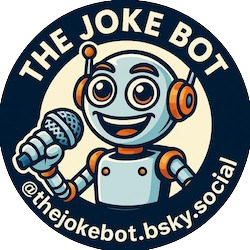

# The Joke Bot

<p align="center"></p>

Posts dad jokes to [Bluesky](https://bsky.app/) and looks after the account through scheduled GitHub Actions. Explore the [public dashboard](https://chris-gillatt.github.io/thejokebot/) for posting, audience and operational trends.

## Status

### Tests

| CI | Quality |
|---|---|
| <a href="https://github.com/chris-gillatt/thejokebot/actions/workflows/python_tests.yml"></a> | <a href="https://github.com/chris-gillatt/thejokebot/actions/workflows/ruff_quality.yml"></a> |
| <a href="https://github.com/chris-gillatt/thejokebot/actions/workflows/validate_runtime_config.yml"></a> | <a href="https://github.com/chris-gillatt/thejokebot/actions/workflows/codeql.yml"></a> |
| <a href="https://sonarcloud.io/summary/overall?id=chris-gillatt_thejokebot"></a> | <a href="https://github.com/chris-gillatt/thejokebot/actions/workflows/dependabot-auto-merge.yml"></a> |

### Actions

| Publishing | Community |
|---|---|
| <a href="https://github.com/chris-gillatt/thejokebot/actions/workflows/bluesky_post_joke.yml"></a> | <a href="https://github.com/chris-gillatt/thejokebot/actions/workflows/bluesky_follows_and_likes.yml"></a> |
| <a href="https://github.com/chris-gillatt/thejokebot/actions/workflows/bluesky_dashboard.yml"></a> | <a href="https://github.com/chris-gillatt/thejokebot/actions/workflows/bluesky_follow_fellows.yml"></a> |
| <a href="https://github.com/chris-gillatt/thejokebot/actions/workflows/bluesky_process_reports.yml"></a> | <a href="https://github.com/chris-gillatt/thejokebot/actions/workflows/bluesky_unfollow.yml"></a> |

## What It Does

| Area | Behaviour |
|---|---|
| Jokes | Rotates through live joke providers and a bundled offline jokebook; avoids repeats within 730 days and fits rotated hashtags within Bluesky's post limit. |
| Community | Follows back, discovers fellow accounts, likes replies and answers explicit tagged joke requests. Unfollow automation respects protected accounts and a 90-day grace period. |
| Moderation | A `#report` reply proposes a permanent joke denylist change for maintainer review; approved jokes are removed from the account. |
| Dashboard | Publishes six-hourly public account and engagement trends alongside operational health. Audience identifiers are excluded from published metrics. |

## Run Locally

Requires Python 3.12 or newer. From the repository root:

```bash
python3.12 -m venv .venv
.venv/bin/python -m pip install --require-hashes --only-binary=:all: -r requirements.lock
.venv/bin/python -m pip install --no-deps --no-build-isolation --editable .
cp .env.example .env
```

Set `BLUESKY_USERNAME` and `BLUESKY_APP_PASSWORD` in the ignored `.env` file, then run `.venv/bin/thejokebot-post-joke`. This command posts live; use a test account for local experiments. `BLUESKY_DRY_RUN` applies to social actions, not joke posting.

Run `./scripts/preflight-local.sh` for the full local quality gate. For just the unit tests, run `./scripts/test-local.sh`. See the [operations guide](docs/operations.md) for configuration, commands, dashboard preview, workflows and safety procedures.

## Further Reading

- [Operations and configuration](docs/operations.md)
- [Changelog](CHANGELOG.md)
- [Current priorities and decisions](problem-statement.md)
- [Security policy](SECURITY.md)

Jokes are supplied by [icanhazdadjoke](https://icanhazdadjoke.com/api), [JokeAPI](https://jokeapi.dev), [GroanDeck](https://groandeck.com/api/v1/random), [Syrsly](https://www.syrsly.com/joke), [API Ninjas](https://api-ninjas.com/api/jokes) and the bundled jokebook.